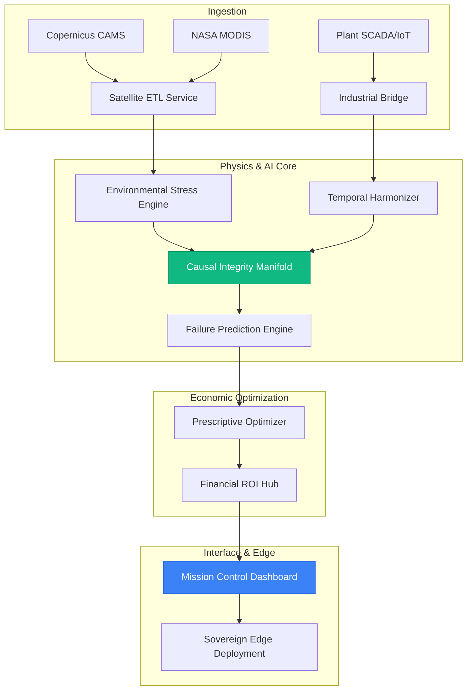

# 🏗️ SAHARYN AI: Technical Diligence Manifest
**System Architecture, Data Flow, and Integration Protocols**

This document provides a comprehensive technical overview of the SAHARYN platform for investor review and technical diligence.

---

## 1. High-Level System Architecture Summary
The SAHARYN platform is built as a multi-layered industrial AI ecosystem designed for mission-critical infrastructure resilience.

*   **Satellite Ingestion Layer**: Aggregates high-fidelity spectral data from **Copernicus CAMS** (EAC4) and **NASA MODIS** granules. It tracks Aerosol Optical Depth (AOD), temperature, and wind vectors in real-time.
*   **Environmental Stress Modeling**: A physics-informed processing pipeline that converts raw satellite data into industrial stressors, such as the **Dust Deposition Index (DSI)** and **Structural Thermal Gradient**.
*   **Telemetry Simulation & SCADA Bridge**: A dual-purpose layer that either simulates industrial SCADA data (for training/demos) or integrates with live plant sensors via **OPC-UA** or **PI Web API**.
*   **Causal AI Engine (The Manifold)**: Unlike standard "black-box" ML, SAHARYN uses a **Causal Integrity Manifold**. It models the physical relationships between environmental stressors and mechanical degradation paths (e.g., *Dust → Filter Occlusion → Rotor Vibration*).
*   **Prescriptive Optimizer**: A financial intelligence layer that evaluates predicted failures against industrial benchmarks (replacement costs + downtime loss) to calculate **Avoided Loss** and **ROI** for specific interventions.
*   **Dashboard & RBAC**: A high-fidelity CSS/JS interface with built-in **Role-Based Access Control (RBAC)**, ensuring that sensitive maintenance commands are restricted to authorized personnel.

---

## 2. Data Flow Diagram
The following diagram illustrates the unidirectional flow of information from ingestion to decision support.

---

## 3. Deployment Architecture
SAHARYN is designed for flexible, hybrid-cloud deployment.

*   **Production Cloud (Railway)**: The primary API Gateway and Causal Core are hosted on Railway, utilizing high-performance workers with automated scaling.
*   **API Gateway**: Fast API-based gateway implementing **AES-256** encryption and OIDC-ready authentication.
*   **Persistence**: PostgreSQL database layer for historical telemetry, audit logs (the Sovereign Ledger), and predictive performance tracking.
*   **Sovereign Edge Mode**: For high-security or remote industrial sites (e.g., NEOM, Riyadh Central), the system can be deployed as an "Air-Gapped" edge node. In this mode, AI inference runs locally on site-installed hardware, syncing with the cloud only for periodic model updates.

---

## 4. Pilot Integration Overview
Transitioning from a demonstration to a live pilot at an industrial site involves a four-step integration protocol.

1.  **Industrial Bridging**: Establish a secure outbound connection from the plant network to SAHARYN via **OPC-UA** or **PI Web API**.
2.  **Tag Mapping**: Configure the `scada_bridge` to map existing plant sensor tags (e.g., `CP_01_VIB_RMS`) to SAHARYN's causal nodes.
3.  **Telemetry Handover**: Disable the simulation module and engage the **Live SCADA Stream**. The system begins ingesting real-world vibration, temperature, and pressure data.
4.  **Edge Commissioning**: If required, install the **Sovereign Edge Node** inside the facility's DMZ to allow for sub-second inference latency and maximum data sovereignty.

---

## 5. Demonstration Scenario Reference
The platform includes pre-calibrated scenarios to demonstrate the predictive maintenance workflow.

| Scenario | Operational Logic | Demonstration Purpose |
| :--- | :--- | :--- |
| **Normal Operation** | Nominal state (AOD < 0.15, Vib < 1.5mm/s). | Establish baseline system stability. |
| **Sandstorm Cascade** | Rapid AOD increase (0.95) causing filter occlusion and rotor vibration surge. | Show causal chain from world event to mechanical risk. |
| **Heat Stress** | Extreme thermal load (>50°C) triggering Arrhenius-based structural decay. | Demonstrate physics-based degradation modeling. |
| **Filtration Failure** | Progressive differential pressure drop at the intake manifold. | Showcase "Early Warning" detection before vibration starts. |
| **System Recovery** | Instant restoration of nominal environment via the `RESET` command. | Demonstrate recovery agility without service restart. |

---

**Approval Status**: FINAL 
**Security Classification**: CONFIDENTIAL (Investor/Technical Partner Access Only)
